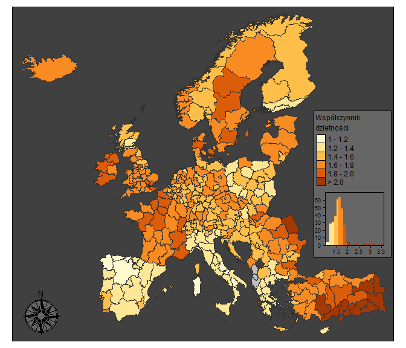
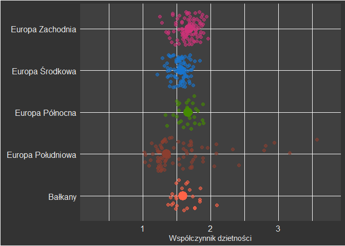
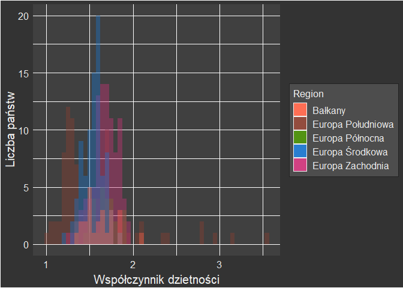
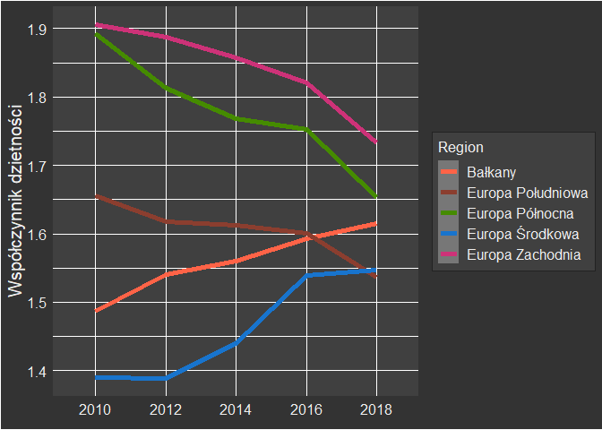
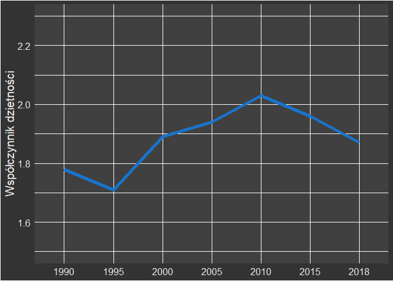

**Rozkład współczynnika dzietności w Europie**
================
**Tomasz Matuszek, Adrian Nowacki, Mateusz Rydzik**

## **1. Wprowadzenie**

**Współczynnik dzietności** (ang. *fertility rate*) określa przeciętną
liczbę dzieci, którą urodziłaby kobieta w ciągu całego okresu
rozrodczego (15-49 lat), przy założeniu, że w poszczególnych fazach tego
okresu rodziłaby z intensywnością obserwowaną wśród kobiet w badanym
roku. Przyjmuje się, iż współczynnik dzietności między 2,10 a 2,15 jest
wartością zapewniającą prostą zastępowalność pokoleń (czyli utrzymanie
liczby ludności populacji).

Celem niniejszej analizy jest scharakteryzowanie współczynnika
dzietności w 37 krajach Europy podzielonych na **jednostki NUTS 2**.
Dane dotyczą roku 2018, a także trendów zmian od końca XX wieku. W
pierwszym etapie przeprowadzono analizę dla wszystkich jednostek, a
następnie w podziale na regiony kontynentu (Europę Północną, Zachodnią,
Środkową, Południową oraz Bałkany). Mapę obrazującą dokonany przez
autorów podział Europy na regiony udostępniono
<a href="https://dl.dropboxusercontent.com/s/jval7cjcnwikmn0/Legenda.jpg?dl=0" target="_blank">tutaj</a>.
Na końcu pracy opisano zmiany współczynnika dzietności we Francji

## **2. Dane**

Analizę przeprowadzono w oparciu o dane dotyczące współczynnika
dzietności w krajach europejskich dostępnych na stronie Eurostatu
(<a href="https://ec.europa.eu/eurostat/databrowser/view/demo_r_frate2/default/table?lang=en" target="_blank">odnośnik</a>).
Dane te dostarczają informacji o liczbie dzieci, które przeciętna
kobieta rodzi w swoim życiu w podziale na jednostki NUTS2.

``` r
library(eurostat)

fer = search_eurostat(pattern = "fertility rate", type = "table")
dane = get_eurostat("tgs00100", type = "code", time_format = "date", filters = list(time = 2018))

# wczytanie danych dla Francji z lat 1990-2018
fr = get_eurostat("demo_r_frate2", type = "code", time_format = "date", 
                  filters = list(time = c(1990, 1995, 2000, 2005, 2010, 2015, 2018), geo = 'FR', age = 'TOTAL'))
```

## **3. Metody**

Analiza statystyczna danych została wykonana w środowisku R. Podczas
analizy i wizualizacji wyników wykorzystano funkcje zawarte w pakietach
podstawowych, a także zewnętrznych, do których zaliczają się:

-   `eurostat` - umożliwia pobranie danych dostępnych w bazach Eurostatu
-   `ggplot2` - wizualizuje dane tworząc wykresy
-   `dplyr` - pozwala na obliczanie statystyk, tworzenie nowych kolumn
    itp.
-   `stringr` - dodaje funkcje operujące na ciągach tekstowych
-   `tmap` - wizualizuje dane przestrzennie tworząc mapy
-   `kableExtra` - generuje złożone tabele z możliwością ich stylizacji

## **4. Charakterystyka współczynnika dzietności w krajach europejskich**

``` r
# minimalna i maksymalna dzietnosc
min(dane$values)
max(dane$values)

# srednia i miediana
mean(dane$values)
median(dane$values)

# odchylenie standardowe
sd(dane$values)

# NUTSy z najwyzsza i najnizsza dzietnoscia
dane[which.max(dane$values),]
dane[which.min(dane$values),]

# kwantyle
quantile(dane$values, na.rm = TRUE)[c(2, 4)]

#zastepowalnosc pokolen
nrow(dane[dane$values > 2.1, ])
```

Według danych pozyskanych z Eurostatu, współczynnik dzietności w krajach
Europy (dla których Eurostat zbiera dane) mieścił się w przedziale 1,02
- 3,57 dziecka na kobietę. **Średnia i mediana** dla tego współczynnika
są prawie identyczne - obydwie wynoszą 1,6 przy odchyleniu standardowym
równym 0.28 (co oznacza że 68% jednostek NUTS 2 ma współczynnik
dzietności w przedziale 1,32 - 1,88). Najwięcej urodzeń na jedną kobietę
**(3,57)** przypada w regionie Sanliurfa w Turcji, natomiast najmniej
**(1,02)** - na Sardynii we Włoszech. Po obliczeniu wartości kwartylnych
okazało się, że w 75% regionów współczynnik dzietności wynosi ponad
1,44, a 1/4 regionów przekracza wartość 1,72. Tylko w 7 regionach
współczynnik dzietności przekracza wartość zapewniającą zastępowalność
pokoleń, czyli 2,1.

Rozkład przestrzenny tych wartości zobrazowano na poniższej mapie (ryc.
1). Przedstawia ona jednostki NUTS 2 wraz z wartościami współczynnika
dzietności. Pod legendą dodano także histogram dla omawianych danych.

``` r
#install.packages("tmap")
library(tmap)
library(dplyr)
library(eurostat)
geodata = get_eurostat_geospatial(output_class = "sf",
                                   resolution = "60",
                                   nuts_level = 2,
                                   year = 2016)
map_data = inner_join(geodata, dane)
map_data = filter(map_data, geo != "FRY5", geo != "FRY3", geo != "FRY4", 
                  geo != "FRY2", geo != "FRY1", geo != "ES7", geo != "ES70", 
                  geo != "PT2", geo != "PT20", geo != "PT3", geo != "PT30")

map2 = tm_shape(map_data, is.master = TRUE) +
  tm_add_legend(title = "Współczynnik\ndzietności", 
                col = c("#ffface", "#fee697", "#febe4a", "#f88b22", "#db5d0a", "#a33803"),
                labels = c("1 - 1.2", "1.2 - 1.4", "1.4 - 1.6",
                           "1.6 - 1.8", "1.8 - 2.0", "> 2.0")) +
  tm_polygons(col = "values", n = 7,
              border.col = "gray20",
              legend.show = FALSE,
              breaks = c(1, 1.2, 1.4, 1.6, 1.8, 2, Inf),
              legend.hist = TRUE) +
  tm_layout(frame.lwd = 1, bg.color = "gray25", attr.color = "black",
            legend.position = c(0.79, 0.25),
            legend.frame = TRUE,
            legend.text.size = 0.75,
            legend.title.size = 0.9,
            legend.hist.width = 0.2,
            legend.hist.height = 0.2,
            legend.hist.bg.color = "gray40",
            legend.bg.color = "gray40") +
  tm_compass(type = "rose", position = c("left", "bottom"),
             color.light = "gray40", size = 4) 
  
map2
```



*                                   Ryc. 1 Mapa rozkładu przestrzennego
współczynnika dzietności w Europie wg jednostek NUTS 2 (2018)*

Po analizie powyższej mapy można zauważyć, że w najcięższej sytuacji
demograficznej znajdują się regiony w krajach śródziemnomorskich –
Hiszpanii, Włoszech i Grecji. Większość regionów ze współczynnikiem
dzietności wyższym niż 2 znajduje się w południowo-wschodniej części
Turcji. Stosunkowo wysoką dzietność mają także obszary Francji,
Irlandii, Szwecji i Rumunii.

Sytuacja demograficzna Polski na tle jej sąsiadów wygląda dość słabo,
chociaż mimo wszystko dzietność w naszym kraju nie jest tak niska jak na
południu Europy – w Polsce wynosi ona 1,4, a w Hiszpanii i Włoszech ok.
1,3.

``` r
library(stringr)
library(dplyr)
# wyodrebnienie nazwy kraju
dane = mutate(dane, country = str_sub(geo, 1, 2))

pl = dane[dane$country == "PL", 5]
mean(pl$values)

es = dane[dane$country == "ES", 5]
mean(es$values)

it = dane[dane$country == "IT", 5]
mean(it$values)
```

## **5. Charakterystyka współczynnika dzietności w podziale na regiony Europy**

W niniejszym rozdziale wartości współczynnika dzietności zostały
przeanalizowane w podziale na pięć regionów Europy: Europę Południową,
Europę Północną, Europę Zachodnią, Europę Środkową oraz Bałkany.
Poniższa tabela (tab. 1) przedstawia zestawienie podstawowych statystyk
opisowych (średniej, mediany, zakresu), a także maksimum, minimum oraz
różnicę pomiędzy trzecim i pierwszym kwartylem (ang. IQR -
*interquartile range*) dla tych poszczególnych regionów. Średnia oraz
mediana posiadają bardzo zbliżone wartości dla wszystkich regionów, z
wyjątkiem Europy Południowej, do której zaliczono również Turcję. Wysoki
współczynnik dzietności Turcji powoduje znacznie większy zakres wartości
w Europie Południowej, wpływając na wszystkie pozostałe statystyki – z
tego powodu zakres dla Europy Południowej wynosi aż 2,55. Statystyki
pozostałych regionów Europy nie wyróżniają się pod żadnym szczególnym
względem – są naturalnie zróżnicowane.

``` r
library(kableExtra)
library(dplyr)
library(stringr)

dane = mutate(dane, country = str_sub(geo, 1, 2))
dane = filter(dane, geo != "FRY5", geo != "FRY3", geo != "FRY4", 
                  geo != "FRY2", geo != "FRY1", geo != "ES7", geo != "ES70", 
                  geo != "PT2", geo != "PT20", geo != "PT3", geo != "PT30")

pattern = c("BG" = "Bałkany", "EL" = "Europa Południowa",  "HR" = "Bałkany", "SI" = "Bałkany", "RS" = "Bałkany", "ME" = "Bałkany", "MK" = "Bałkany", "IT" = "Europa Południowa", "AL" = "Bałkany", "MT" = "Europa Południowa", "DK" = "Europa Północna", "NO" = "Europa Północna", "FI" = "Europa Północna", "SE" = "Europa Północna", "IS" = "Europa Północna", "IE" = "Europa Zachodnia", "BE" = "Europa Zachodnia", "UK" = "Europa Zachodnia", "FR" = "Europa Zachodnia", "LU" = "Europa Zachodnia", "NL" = "Europa Zachodnia", "ES" = "Europa Południowa", "CY" = "Europa Południowa", "PT" = "Europa Południowa","CZ" = "Europa Środkowa", "DE" = "Europa Środkowa", "PL" = "Europa Środkowa", "AT" = "Europa Środkowa", "HU" = "Europa Środkowa", "SK" = "Europa Środkowa", "LI" = "Europa Środkowa", "CH" = "Europa Zachodnia", "SI" = "Europa Środkowa", "EE" = "Europa Północna", "LT" = "Europa Północna", "LV" = "Europa Północna", "RO" = "Bałkany", "TR" = "Europa Południowa")
dane = mutate(dane, region = str_replace_all(country, pattern))

#potrzebne dane z srednia_dziet_08-18(dane2018)

#statystyki opisowe dla poszczególnych regionów
grupy = group_by(dane, region)
statystyka_dziet <- summarise(grupy, 
                              srednia = mean(values), 
                              mediana = median(values),
                              min = min(values), 
                              max = max(values),
                              IQR = IQR(values, na.rm = TRUE),
                              zakres = max(values)-min(values))
colnames(statystyka_dziet) <- c("Region", "Średnia", "Mediana", "Minimum",
                                         "Maksimum", "IQR", "Zakres")

tabela = kbl(statystyka_dziet, align = 'c', digits = 2)
kable_material_dark(tabela, html_font = "Arial", full_width = T)
```

<table class=" lightable-material-dark" style="font-family: Arial; margin-left: auto; margin-right: auto;">
<thead>
<tr>
<th style="text-align:center;">
Region
</th>
<th style="text-align:center;">
Średnia
</th>
<th style="text-align:center;">
Mediana
</th>
<th style="text-align:center;">
Minimum
</th>
<th style="text-align:center;">
Maksimum
</th>
<th style="text-align:center;">
IQR
</th>
<th style="text-align:center;">
Zakres
</th>
</tr>
</thead>
<tbody>
<tr>
<td style="text-align:center;">
Bałkany
</td>
<td style="text-align:center;">
NA
</td>
<td style="text-align:center;">
NA
</td>
<td style="text-align:center;">
NA
</td>
<td style="text-align:center;">
NA
</td>
<td style="text-align:center;">
0.26
</td>
<td style="text-align:center;">
NA
</td>
</tr>
<tr>
<td style="text-align:center;">
Europa Południowa
</td>
<td style="text-align:center;">
1.55
</td>
<td style="text-align:center;">
1.35
</td>
<td style="text-align:center;">
1.02
</td>
<td style="text-align:center;">
3.57
</td>
<td style="text-align:center;">
0.45
</td>
<td style="text-align:center;">
2.55
</td>
</tr>
<tr>
<td style="text-align:center;">
Europa Północna
</td>
<td style="text-align:center;">
1.65
</td>
<td style="text-align:center;">
1.67
</td>
<td style="text-align:center;">
1.33
</td>
<td style="text-align:center;">
1.90
</td>
<td style="text-align:center;">
0.23
</td>
<td style="text-align:center;">
0.57
</td>
</tr>
<tr>
<td style="text-align:center;">
Europa Środkowa
</td>
<td style="text-align:center;">
1.55
</td>
<td style="text-align:center;">
1.56
</td>
<td style="text-align:center;">
1.21
</td>
<td style="text-align:center;">
1.84
</td>
<td style="text-align:center;">
0.15
</td>
<td style="text-align:center;">
0.63
</td>
</tr>
<tr>
<td style="text-align:center;">
Europa Zachodnia
</td>
<td style="text-align:center;">
1.67
</td>
<td style="text-align:center;">
1.68
</td>
<td style="text-align:center;">
1.25
</td>
<td style="text-align:center;">
1.96
</td>
<td style="text-align:center;">
0.19
</td>
<td style="text-align:center;">
0.71
</td>
</tr>
</tbody>
</table>

*Tab. 1 Statystyki opisowe dla dzietności w 2018 roku w podziale na
regiony*

``` r
library(ggplot2)
library(dplyr)
library(stringr)
library(tmap)

dane = mutate(dane, country = str_sub(geo, 1, 2))
dane = filter(dane, geo != "FRY5", geo != "FRY3", geo != "FRY4", 
                  geo != "FRY2", geo != "FRY1", geo != "ES7", geo != "ES70", 
                  geo != "PT2", geo != "PT20", geo != "PT3", geo != "PT30")
dane_regiony = mutate(dane, region = str_replace_all(country, c("BG" = "Bałkany", "EL" = "Europa Południowa", "HR" = "Bałkany", "SI" = "Bałkany", "RS" = "Bałkany", "ME" = "Bałkany", "MK" = "Bałkany", "IT" = "Europa Południowa", "AL" = "Bałkany", "MT" = "Europa Południowa", "DK" = "Europa Północna", "NO" = "Europa Północna", "FI" = "Europa Północna", "SE" = "Europa Północna", "IS" = "Europa Północna", "IE" = "Europa Zachodnia", "BE" = "Europa Zachodnia", "UK" = "Europa Zachodnia", "FR" = "Europa Zachodnia", "LU" = "Europa Zachodnia", "NL" = "Europa Zachodnia", "ES" = "Europa Południowa", "CY" = "Europa Południowa", "PT" = "Europa Południowa","CZ" = "Europa Środkowa", "DE" = "Europa Środkowa", "PL" = "Europa Środkowa", "AT" = "Europa Środkowa", "HU" = "Europa Środkowa", "SK" = "Europa Środkowa", "LI" = "Europa Środkowa", "CH" = "Europa Zachodnia", "SI" = "Europa Środkowa", "EE" = "Europa Północna", "LT" = "Europa Północna", "LV" = "Europa Północna", "RO" = "Bałkany", "TR" = "Europa Południowa")))

ggplot(dane_regiony, aes(x = region, y = values, col = region)) +
  coord_flip() + scale_color_manual(values = c("tomato", "coral4", "chartreuse4", "dodgerblue3", "violetred3")) +
  ylim(0.25, 3.75) +
  #geom_boxplot(col = "black") +
  labs(y = "Współczynnik dzietności", x = element_blank(), col = "Region") +
  theme(legend.position = "none", 
        plot.background = element_rect(fill = "gray20"), 
        panel.background = element_rect(fill = "gray25"),
        axis.text = element_text(size = 12, color = "#eeeeee"),
        axis.title.x = element_text(color = "#eeeeee")) +
  geom_hline(yintercept = median(dane$values), color = "darkred", size = 1.5) +
  geom_jitter(size = 2, alpha = 0.6, width = 0.4) +
  stat_summary(fun = median, geom = "point", size = 6)
```



*Ryc. 2 Rozrzut wartości współczynnika dzietności w podziale na regiony
Europy. Każda mała kropka to jedna jednostka NUTS, a większe punkty
                                to wartość mediany dla danego regionu.
Medianę dla całego kontynentu obrazuje pionowa, czerwona linia.*

``` r
library(ggplot2)
library(dplyr)
library(stringr)

# srednia dzietnosci dla poszczegolnych regionow
grupy = group_by(dane_regiony, region)
grupy_summary =  summarize(grupy, srednia = mean(values))

ggplot(dane_regiony, aes(x=values, fill = region)) +
  scale_fill_manual(values = c("tomato", "coral4", "chartreuse4", "dodgerblue3", "violetred3")) +
  geom_histogram(data=subset(dane_regiony, region == 'Europa Południowa'), alpha = 0.4, binwidth = 0.05) +
  geom_histogram(data=subset(dane_regiony, region == 'Europa Północna'), alpha = 0.4, binwidth = 0.05) +
  geom_histogram(data=subset(dane_regiony, region == 'Europa Zachodnia'), alpha = 0.4, binwidth = 0.05) +
  geom_histogram(data=subset(dane_regiony, region == 'Europa Środkowa'), alpha = 0.4, binwidth = 0.05) +
  geom_histogram(data=subset(dane_regiony, region == 'Bałkany'), alpha = 0.4, binwidth = 0.05) + 
  labs(x = "Współczynnik dzietności", y = "Liczba państw", fill = 'Region' ) + 
  theme(plot.background = element_rect(fill = "gray20"), 
    panel.background = element_rect(fill = "gray25"), 
    axis.title = element_text(size = 15, color = "#eeeeee"), 
    legend.background = element_rect(color = "#222222", fill = "gray30"),  
    legend.title = element_text(size = 13, colour = "#eeeeee"),
    legend.text = element_text(size = 12, colour = "#eeeeee"),
    axis.text = element_text(size = 12, color = "#eeeeee"),
    axis.title.x = element_text(vjust = 0))
```



*              Ryc. 3 Nałożone na siebie histogramy obrazujące rozkład
wartości współczynnika dzietności dla poszczególnych regionów Europy.*

Analizując powyższe wykresy (ryc. 2, ryc. 3) można zauważyć, że
większość regionów Europy ma w miarę równomierny rozkład wartości
współczynnika dzietności, a także medianę zbliżoną do mediany całego
kontynentu. Jedynym regionem, którego mediana znacząco się różni od
mediany europejskiej jest Europa Południowa. Hiszpania, Włochy i Grecja
są bowiem krajami, w których żadnym regionie współczynnik dzietności nie
przekracza 1,4. (ryc. 1) Europa Południowa ma też największy rozrzut
wartości ze wszystkich regionów z tego powodu, że została do niej
zaliczona także Turcja która w przeciwieństwie do innych krajów
śródziemnomorskich charakteryzuje się stosunkowo wysoką dzietnością
(szczególnie w regionach południowo-wschodnich). Z histogramu można też
wywnioskować, że kraje Europy Zachodniej nie mają aż takich problemów z
dzietnością jak ich południowi sąsiedzi. Generalnie jednak, rozkład
wartości na histogramie można określić jako zbliżony do normalnego.

``` r
library(eurostat)
library(ggplot2)
library(dplyr)
library(stringr)

dane2010 = get_eurostat("tgs00100", type = "code", time_format = "date", filters = list(time = 2010))
dane2012 = get_eurostat("tgs00100", type = "code", time_format = "date", filters = list(time = 2012))
dane2014 = get_eurostat("tgs00100", type = "code", time_format = "date", filters = list(time = 2014))
dane2016 = get_eurostat("tgs00100", type = "code", time_format = "date", filters = list(time = 2016))
dane2018 = get_eurostat("tgs00100", type = "code", time_format = "date", filters = list(time = 2018))

dane2010 = mutate(dane2010, country = str_sub(geo, 1, 2))
dane2012 = mutate(dane2012, country = str_sub(geo, 1, 2))
dane2014 = mutate(dane2014, country = str_sub(geo, 1, 2))
dane2016 = mutate(dane2016, country = str_sub(geo, 1, 2))
dane2018 = mutate(dane2018, country = str_sub(geo, 1, 2))

pattern = c("BG" = "Bałkany", "EL" = "Europa Południowa",  "HR" = "Bałkany", "SI" = "Bałkany", "RS" = "Bałkany", "ME" = "Bałkany", "MK" = "Bałkany", "IT" = "Europa Południowa", "AL" = "Bałkany", "MT" = "Europa Południowa", "DK" = "Europa Północna", "NO" = "Europa Północna", "FI" = "Europa Północna", "SE" = "Europa Północna", "IS" = "Europa Północna", "IE" = "Europa Zachodnia", "BE" = "Europa Zachodnia", "UK" = "Europa Zachodnia", "FR" = "Europa Zachodnia", "LU" = "Europa Zachodnia", "NL" = "Europa Zachodnia", "ES" = "Europa Południowa", "CY" = "Europa Południowa", "PT" = "Europa Południowa","CZ" = "Europa Środkowa", "DE" = "Europa Środkowa", "PL" = "Europa Środkowa", "AT" = "Europa Środkowa", "HU" = "Europa Środkowa", "SK" = "Europa Środkowa", "LI" = "Europa Środkowa", "CH" = "Europa Zachodnia", "SI" = "Europa Środkowa", "EE" = "Europa Północna", "LT" = "Europa Północna", "LV" = "Europa Północna", "RO" = "Bałkany", "TR" = "Europa Południowa")

dane2010 = mutate(dane2010, region = str_replace_all(country, pattern))
dane2012 = mutate(dane2012, region = str_replace_all(country, pattern))
dane2014 = mutate(dane2014, region = str_replace_all(country, pattern))
dane2016 = mutate(dane2016, region = str_replace_all(country, pattern))
dane2018 = mutate(dane2018, region = str_replace_all(country, pattern))

dane2010_grouped = group_by(dane2010, region)
dane2012_grouped = group_by(dane2012, region)
dane2014_grouped = group_by(dane2014, region)
dane2016_grouped = group_by(dane2016, region)
dane2018_grouped = group_by(dane2018, region)

summary2010 = summarize(dane2010_grouped, srednia = as.numeric(mean(values, na.rm = TRUE)))
summary2012 = summarize(dane2012_grouped, srednia = as.numeric(mean(values, na.rm = TRUE)))
summary2014 = summarize(dane2014_grouped, srednia = as.numeric(mean(values, na.rm = TRUE)))
summary2016 = summarize(dane2016_grouped, srednia = as.numeric(mean(values, na.rm = TRUE)))
summary2018 = summarize(dane2018_grouped, srednia = as.numeric(mean(values, na.rm = TRUE)))

balkany = as.data.frame(matrix(as.numeric(c(summary2010[1, 2],
                 summary2012[1, 2], summary2014[1, 2],
                 summary2016[1, 2], summary2018[1, 2])), 
                 ncol=1,byrow=TRUE))

europa_pd = as.data.frame(matrix(as.numeric(c(summary2010[2, 2],
                   summary2012[2, 2], summary2014[2, 2],
                   summary2016[2, 2], summary2018[2, 2])), 
                   ncol=1,byrow=TRUE))

europa_pn = as.data.frame(matrix(as.numeric(c(summary2010[3, 2],
                   summary2012[3, 2], summary2014[3, 2],
                   summary2016[3, 2], summary2018[3, 2])), 
                   ncol=1,byrow=TRUE))

europa_sr = as.data.frame(matrix(as.numeric(c(summary2010[4, 2],
                   summary2012[4, 2], summary2014[4, 2],
                   summary2016[4, 2], summary2018[4, 2])), 
                   ncol=1,byrow=TRUE))

europa_zach = as.data.frame(matrix(as.numeric(c(summary2010[5, 2],
                   summary2012[5, 2], summary2014[5, 2],
                   summary2016[5, 2], summary2018[5, 2])), 
                   ncol=1,byrow=TRUE))

europa_pn = mutate(europa_pn, rok = as.character(c(2010, 2012, 2014, 2016, 2018)))
europa_pd = mutate(europa_pd, rok = as.character(c(2010, 2012, 2014, 2016, 2018)))
europa_sr = mutate(europa_sr, rok = as.character(c( 2010, 2012, 2014, 2016, 2018)))
europa_zach = mutate(europa_zach, rok = as.character(c(2010, 2012, 2014, 2016, 2018)))
balkany = mutate(balkany, rok =as.character(c(2010, 2012, 2014, 2016, 2018)))

colnames(balkany) = c("srednia", "rok")
colnames(europa_sr) = c("srednia", "rok")
colnames(europa_pd) = c("srednia", "rok")
colnames(europa_zach) = c("srednia", "rok")
colnames(europa_pn) = c("srednia", "rok")

europa_pn = mutate(europa_pn, region = "Europa Północna")
europa_pd = mutate(europa_pd, region = "Europa Południowa")
europa_sr = mutate(europa_sr, region = "Europa Środkowa")
europa_zach = mutate(europa_zach, region = "Europa Zachodnia")
balkany= mutate(balkany, region = "Bałkany")

regiony = rbind(europa_pn, balkany, europa_pd, europa_zach, europa_sr)

ggplot(regiony, aes(rok, srednia, group = region, color = region)) + 
  geom_line(size = 1.8) + scale_color_manual(values = c("tomato", "coral4", "chartreuse4", "dodgerblue3", "violetred3")) +
  labs(x = element_blank(), y = "Współczynnik dzietności", col = "Region") +
  theme(plot.background = element_rect(fill = "gray20"), 
    panel.background = element_rect(fill = "gray25"), 
    axis.title = element_text(size = 15, color = "#eeeeee"), 
    legend.background = element_rect(color = "#222222", fill = "gray25"),  
    legend.title = element_text(size = 13, color = "#eeeeee"),
    legend.text = element_text(size = 12, color = "#eeeeee"),
    legend.key = element_rect(fill = "#777777"),
    axis.text = element_text(size = 12, color = "#eeeeee"),
    axis.title.x = element_text(vjust = 0))
```



*                              Ryc. 4 Zmiany współczynnika dzietności w
regionach Europy w latach 2010 – 2018.*

Wykres zamieszczony na rycinie 4 ukazuje zmiany współczynnika dzietności
w wydzielonych regionach Europy w latach 2010-2018. Zauważalne jest
zmniejszenie rozstępu średniej wartości na przestrzeni kolejnych lat. W
2010 roku, różnica między regionem o najwyższym współczynniku dzietności
(Europa Zachodnia), a najniższym (Europa Środkowa) wynosiła 0,53.
Rozstęp między Europą Zachodnią a Europą Południową w 2018 wynosił
natomiast 0,19. Spadek rozstępu podkreśla zmniejszenie wielkości różnic
wskaźnika dzietności między krajami europejskimi. Z podanych na wykresie
regionów, trzy z nich odnotowują spadek średniej wartości współczynnika
dzietności. Są to: Europa Zachodnia, Europa Północna i Europa
Południowa. Wzrost średniej wartości współczynnika dzietności
zarejestrowano jedynie w Europie Środkowej i na Bałkanach.

## **6. Współczynnik dzietności we Francji na przestrzeni lat**

Francja wyróżnia się wysokim współczynnikiem dzietności spośród krajów
europejskich. Analiza państwa w wielu obszarach pomoże uzyskać
podstawowe czynniki, wpływające na wielkość wskaźnika dzietności.

``` r
library(eurostat)
library(stringr)
library(dplyr)
library(ggplot2)

fr = select(fr, Data = `time`, Wartość = `values`)
fr$Data = str_replace(fr$Data, "-01-01", "")

ggplot(fr, aes(Data, Wartość, group = 1)) + geom_line(color = 'dodgerblue3', size = 1.8) +
  ylim(1.5, 2.3) + labs(y = "Współczynnik dzietności") +
  theme(plot.background = element_rect(fill = "gray20"), 
        panel.background = element_rect(fill = "gray25"),
        axis.title.x = element_blank(),
        axis.title = element_text(size = 15, color = "#eeeeee"), 
        axis.text = element_text(size = 12,  color = "#eeeeee"))
```



*                              Ryc. 5 Zmiany współczynnika dzietności we
Francji w latach 1990 – 2018.*

Od lat 20 XX wieku wartość współczynnika dzietności kraju nie spadła
poniżej 1,6. Po powojennym wyżu demograficznym, wielkość wskaźnika
malała do roku 1995, gdzie osiągnęła wartość 1,7 (ryc. 5). Od tego
momentu, współczynnik dzietności Francji wzrastał do 2010. Zanotowano
wtedy wartość 2,03. Współczynnik dzietności przekroczył wartość 2,0
pierwszy raz od ponad 30 lat.

Znaczący wzrost wskaźnika dzietności we Francji przypisywany jest
polityce społecznej i gospodarczej kraju. Nacisk rządu francuskiego na
politykę pro-rodzinną pozwolił na rozszerzenie zakresu świadczeń
rodzinnych. Udostępniono rozszerzone zasiłki oraz dodatki do czynszów.
Wprowadzono urlop wychowawczy, ujednolicony dla obydwu rodziców.
Rozwinięto także struktury opieki nad dziećmi, m.in. zwiększenie
wydatków na utrzymywanie żłobków czy przedszkoli.

Koncentracja rządu na polityce ‘pro-family’ uzasadniana jest strukturą
ekonomiczną państwa. Bilans handlowy Francji w kilkunastu ostatnich
latach osiąga wartości ujemne. Przewaga importu nad eksportem wymaga
zwiększenia rynku konsumpcyjnego, co bezpośrednio oddziałuje na
konieczność zachowania współczynnika dzietności na wysokim poziomie.

Warty zaznaczenia jest także duży udział w populacji Francji osób z
regionu Afryki Północnej. Ludność ta, w większości wyznania
muzułmańskiego, charakteryzuje się wysokim wskaźnikiem dzietności,
wpływając na wzrost wskaźnika narodowego.

Mimo tego, od 2010 odnotowywany jest spadek współczynnika dzietności we
Francji. Dodatkowo, ogłoszone odejście rządu od rozbudowanej polityki
pro-rodzinnej prognozuje utrzymanie regresji wskaźnika dzietności na
najbliższe lata.

## **7. Podsumowanie**

Przeprowadzona analiza współczynnika dzietności w Europie ukazała, że
istnieją pewne regionalne różnice w jego rozkładzie przestrzennym.
Państwa śródziemnomorskie okazały się mieć dramatycznie niską
zastępowalność pokoleń oraz silnie kontrastować z innym państwem
śródziemnomorskim – Turcją. (ryc. 1, ryc. 2) W innych częściach
kontynentu zróżnicowanie dzietności jest mniejsze, a także współczynnik
ten przyjmuje generalnie wyższe wartości. Najlepiej sytuacja wygląda we
Francji, Szwecji, Irlandii oraz wschodniej części Rumunii. Polska na tle
Europy jawi się jako kraj o średniej wysokości współczynnika dzietności
– jest on niższy niż np. we Francji czy Turcji, jednak sytuacja w naszym
kraju nadal wygląda lepiej niż w Hiszpanii czy Włoszech.

Generalnie jednak, analiza ta pokazuje, w jak słabej sytuacji
demograficznej znalazły się kraje europejskie – w żadnym z nich nie jest
zagwarantowana zastępowalność pokoleń. Będzie to prawdopodobnie jeden z
kluczowych problemów z jakimi będą borykały się europejskie rządy w
nadchodzących dekadach.

``` r
tur = dane[dane$country == "TR", 5]
mean(tur$values)

pl = dane[dane$country == "PL", 5]
mean(pl$values)

fr = dane[dane$country == "FR", 5]
mean(fr$values)

ro = dane[dane$country == "RO", 5]
mean(ro$values)

es = dane[dane$country == "ES", 5]
mean(es$values)

it = dane[dane$country == "IT", 5]
mean(it$values)
```
